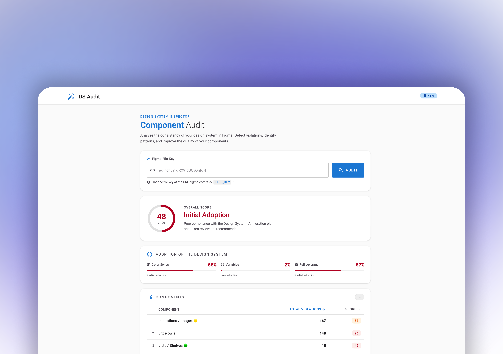

# Figma Audit Dashboard

A Design System auditing platform designed to measure adoption, identify inconsistencies, and support governance decisions across Figma files.

<p align="center">
  
</p>

## Context

As Design Systems evolve, organizations often struggle to understand how consistently their assets are being adopted across products and teams.

Without measurable indicators, migrations become difficult to track, governance becomes reactive, and Design System debt accumulates over time.

This project was created to provide objective metrics that help Design System teams monitor adoption, identify gaps, and prioritize maintenance efforts.

## Purpose

The platform evaluates how Design System assets are being consumed throughout a Figma ecosystem and transforms that information into actionable governance metrics.

The goal is to provide visibility into Design System health by measuring the adoption of assets such as:

* Variables
* Styles
* Tokens
* Component definitions
* Other Design System primitives

## Current Scope

The current version focuses on color-related assets as the first stage of the auditing framework.

While the platform architecture is designed to support broader Design System analysis, the current implementation measures adoption through:

* Figma Variables
* Legacy Styles
* Hardcoded values
* Component-level coverage metrics

## Metrics

### Design System Coverage

Measures how much of the analyzed content is connected to Design System assets.

```text
Design System Coverage = (Styles + Variables) / Total Solid Fills
```

A coverage score of 100% indicates that every analyzed asset is connected to the Design System through either Styles or Variables.

Coverage measures connectivity, regardless of whether the asset is using legacy or modern Design System technologies.

### Variable Adoption

Measures migration progress from legacy Styles to Variables.

```text
Variable Adoption = Variables / Total Solid Fills
```

This metric helps teams evaluate modernization efforts and monitor migration progress.

### Design System Maturity Score

Measures the quality of Design System adoption by assigning different weights to each implementation approach.

```text
Hardcoded Values = 0
Styles = 70
Variables = 100
```

The final score is calculated using a weighted average across all analyzed assets.

This approach distinguishes Design System connectivity from Design System maturity, allowing teams to understand not only whether assets are connected to the system, but also how modern and maintainable that adoption is.

## Features

* Design System adoption analysis
* Variable adoption tracking
* Hardcoded value detection
* Component-level reporting
* Governance support metrics

## Tech Stack

* Node.js
* Express
* Figma API
* JavaScript

## Roadmap

Future iterations will expand auditing capabilities to additional Design System dimensions, including:

* Typography
* Effects
* Spacing
* Radius
* Component usage
* Token adoption
* Cross-library governance indicators

The long-term vision is to provide a comprehensive Design System Health Score capable of measuring adoption and consistency across an entire design ecosystem.
